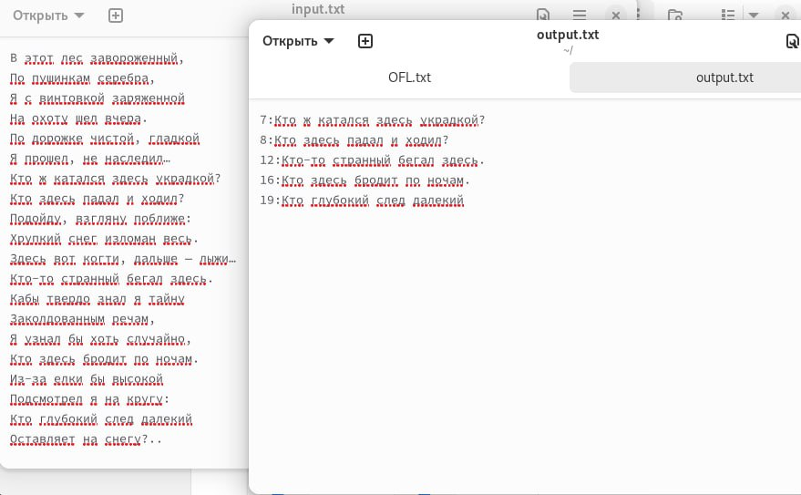
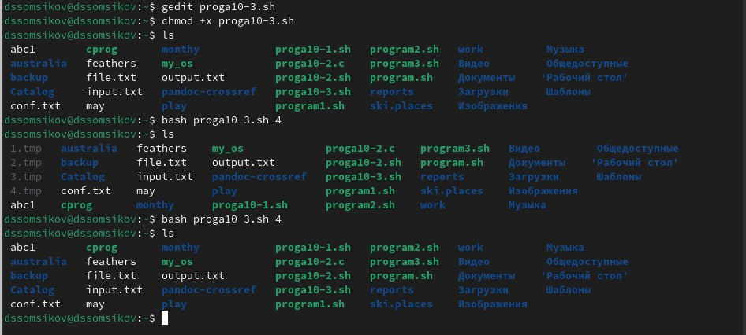
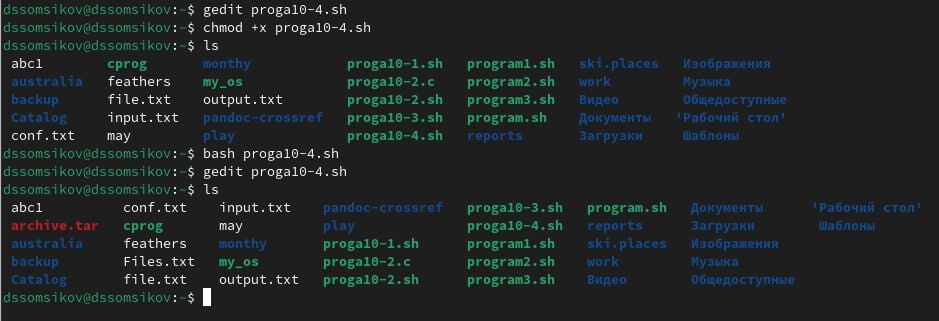

---
## Front matter
title: "Отчет по лабораторной работе №10"
subtitle: "Программирование в командном процессоре ОС UNIX. Ветвления и циклы."
author: "Сомсиков Даниил Сергеевич"

## Generic otions
lang: ru-RU
toc-title: "Содержание"

## Bibliography
bibliography: bib/cite.bib
csl: pandoc/csl/gost-r-7-0-5-2008-numeric.csl

## Pdf output format
toc: true # Table of contents
toc-depth: 2
lof: true # List of figures
lot: true # List of tables
fontsize: 12pt
linestretch: 1.5
papersize: a4
documentclass: scrreprt
## I18n polyglossia
polyglossia-lang:
  name: russian
  options:
	- spelling=modern
	- babelshorthands=true
polyglossia-otherlangs:
  name: english
## I18n babel
babel-lang: russian
babel-otherlangs: english
## Fonts
mainfont: PT Mono
romanfont: PT Mono
sansfont: PT Mono
monofont: PT Mono
mainfontoptions: Ligatures=TeX
romanfontoptions: Ligatures=TeX
sansfontoptions: Ligatures=TeX,Scale=MatchLowercase
monofontoptions: Scale=MatchLowercase,Scale=0.9
## Biblatex
biblatex: true
biblio-style: "gost-numeric"
biblatexoptions:
  - parentracker=true
  - backend=biber
  - hyperref=auto
  - language=auto
  - autolang=other*
  - citestyle=gost-numeric
## Pandoc-crossref LaTeX customization
figureTitle: "Рис."
tableTitle: "Таблица"
listingTitle: "Листинг"
lofTitle: "Список иллюстраций"
lotTitle: "Список таблиц"
lolTitle: "Листинги"
## Misc options
indent: true
header-includes:
  - \usepackage{indentfirst}
  - \usepackage{float} # keep figures where there are in the text
  - \floatplacement{figure}{H} # keep figures where there are in the text
---

# Цель работы

Изучить основы программирования в оболочке ОС UNIX. Научится писать более сложные командные файлы с использованием логических управляющих конструкций и циклов.

# Задание

1. Используя команды getopts grep, написать командный файл, который анализирует командную строку с ключами:

- -i - inputfile — прочитать данные из указанного файла;
- -o - outputfile — вывести данные в указанный файл;
- -p - шаблон — указать шаблон для поиска;
- -C — различать большие и малые буквы;
- -n — выдавать номера строк.

а затем ищет в указанном файле нужные строки, определяемые ключом -p.

2. Написать на языке Си программу, которая вводит число и определяет, является ли оно больше нуля, меньше нуля или равно нулю. Затем программа завершается с помощью
функции exit(n), передавая информацию о коде завершения в оболочку. Командный файл должен вызывать эту программу и, проанализировав с помощью команды $?, выдать сообщение о том, какое число было введено.

3. Написать командный файл, создающий указанное число файлов, пронумерованных последовательно от 1 до N (например 1.tmp, 2.tmp, 3.tmp,4.tmp и т.д.). Число файлов, которые необходимо создать, передаётся в аргументы командной строки. Этот же командный файл должен уметь удалять все созданные им файлы (если они существуют).

4. Написать командный файл, который с помощью команды tar запаковывает в архив все файлы в указанной директории. Модифицировать его так, чтобы запаковывались только те файлы, которые были изменены менее недели тому назад (использовать команду find).


# Теоретическое введение

## Переменные в языке программирования bash

Командный процессор bash обеспечивает возможность использования переменных типа строка символов. Имена переменных могут быть выбраны пользователем. Пользователь имеет возможность присвоить переменной значение некоторой строки символов.

Например, команда

```
mark=/usr/andy/bin
```

переместит файл afile из текущего каталога в каталог с абсолютным полным именем */usr/andy/bin*.
Использование значения, присвоенного некоторой переменной, называется подстановкой. Для того чтобы имя переменной не сливалось с символами, которые могут следовать за ним в командной строке, при подстановке в общем случае используется следующая форма записи:

```
${имя переменной}
```

Оболочка bash позволяет работать с массивами. Для создания массива используется команда set с флагом -A. За флагом следует имя переменной, а затем список значений, разделённых пробелами. Например,
  
```
set -A states Delaware Michigan "New Jersey"
```

## Использование арифметических вычислений. Операторы let и read

Команда let берет два операнда и присваивает их переменной. Положительным моментом команды let можно считать то, что для идентификации переменной ей не нужен знак доллара; вы можете писать команды типа let sum=x+7, и let будет искать переменную x и добавлять к ней 7.

Команда let также расширяет другие выражения let, если они заключены в двойные круглые скобки. Таким способом вы можете создавать довольно сложные выражения. Команда let не ограничена простыми арифметическими выражениями.
  
Команда read позволяет читать значения переменных со стандартного ввода:
  
```
echo "Please enter Month and Day of Birth ?"
read mon day trash
```

## Командные файлы и функции

Последовательность команд может быть помещена в текстовый файл. Такой файл называется командным. Далее этот файл можно выполнить по команде:
  
```
bash командный_файл [аргументы]
```

Чтобы не вводить каждый раз последовательности символов bash, необходимо изменить код защиты этого командного файла, обеспечив доступ к этому файлу по выполнению. Это может быть сделано с помощью команды
  
```
chmod +x имя_файла
```

# Выполнение лабораторной работы

1. Используя команды getopts grep, нужно написать командный файл, который анализирует командную строку с ключами (-i, -o, -p,-c, -n), а затем ищет в указанном файле нужные строки, определяемые ключом -p  (рис. [-@fig:001]):
	
{#fig:001 width=100%}

Создаем один текстовый файл со стихотворением "input.txt" и файл, в который будет записываться результат "output.txt". Делаем файл "prog10-1.sh" исполняемым и выводим результат (рис. [-@fig:002]), (рис. [-@fig:003]).

{#fig:002 width=100%}
    
{#fig:003 width=100%}

2. Нужно написать на языке Си программу, которая вводит число и определяет, является ли оно больше нуля, меньше нуля или равно нулю. Затем программа завершается с помощью функции exit(n), передавая информацию о коде завершения в оболочку. Командный файл должен вызывать эту программу и, проанализировав с помощью команды $?, выдать сообщение о том, какое число было введено (рис. [-@fig:004]), (рис. [-@fig:005]):

{#fig:004 width=100%}

{#fig:005 width=100%}

Делаем файлы исполняемыми и выводим результат (рис. [-@fig:006]).
    
{#fig:006 width=100%}

3. Нужно написать командный файл, создающий указанное число файлов, пронумерованных последовательно от 1 до N. Число файлов, которые необходимо создать, передаётся в аргументы командной строки. Этот же командный файл должен уметь удалять все созданные им файлы (рис. [-@fig:007]):
    
{#fig:007 width=100%}

Делаем файлы исполняемыми и выводим результат (рис. [-@fig:008]).
    
{#fig:008 width=100%}

4. Нужно написать командный файл, который с помощью команды tar запаковывает в архив все файлы в указанной директории. Модифицировать его так, чтобы запаковывались только те файлы, которые были изменены менее недели тому назад, использовав команду find (рис. [-@fig:009]):
  
{#fig:009 width=100%}

Делаем файлы исполняемыми и выводим результат (рис. [-@fig:010]).
    
{#fig:010 width=100%}

# Контрольные вопросы

1. **Каково предназначение команды getopts?**

Команда getopts используется для обработки аргументов командной строки. Она позволяет извлекать опции и их значения из списка аргументов.

2. **Какое отношение метасимволы имеют к генерации имён файлов?**

Метасимволы используются в генерации имён файлов для сопоставления шаблонов. Например, звездочка (*) сопоставляет любое количество символов, а знак вопроса (?) сопоставляет любой один символ.

3. **Какие операторы управления действиями вы знаете?**

Операторы управления действиями используются для изменения потока выполнения скрипта. Вот некоторые из наиболее распространенных операторов управления действиями:

- **if...then...else:** Выполняет блок кода, если условие истинно. Если условие ложно, выполняется блок кода else.
- **for...do...done:** Выполняет блок кода для каждого элемента в списке.
- **while...do...done:** Выполняет блок кода, пока условие истинно.
- **until...do...done:** Выполняет блок кода, пока условие ложно.

4. **Какие операторы используются для прерывания цикла?**

- **continue:** Переходит к следующей итерации цикла, пропуская оставшиеся операторы в текущей итерации.
- **break:** Немедленно выходит из цикла.

5. **Для чего нужны команды false и true?**

Команды false и true используются для возврата кода выхода, указывающего на успех (true) или неудачу (false).

6. **Что означает строка if test -f man$s/$i.$s, встреченная в командном файле?**

Эта строка проверяет, существует ли файл с именем man$s/$i.$s. Если файл существует, выполняется оператор then.

7. **Объясните различия между конструкциями while и until.**

- **while:** Выполняет код, пока условие истинно.
- **until:** Выполняет код, пока условие ложно.

# Выводы

В данной лабораторной работе я изучила основы программирования в оболочке ОС UNIX, а также научилась писать более сложные командные файлы с использованием логических управляющих конструкций и циклов.

::: {#refs}
:::
