---
## Front matter
title: "Отчет по лабораторной работе №12"
subtitle: "Средства, применяемые при разработке программного обеспечения в ОС типа UNIX/Linux"
author: "Сомсиков Даниил Сергеевич"

## Generic otions
lang: ru-RU
toc-title: "Содержание"

## Bibliography
bibliography: bib/cite.bib
csl: pandoc/csl/gost-r-7-0-5-2008-numeric.csl

## Pdf output format
toc: true # Table of contents
toc-depth: 2
lof: true # List of figures
fontsize: 12pt
linestretch: 1.5
papersize: a4
documentclass: scrreprt
## I18n polyglossia
polyglossia-lang:
  name: russian
  options:
	- spelling=modern
	- babelshorthands=true
polyglossia-otherlangs:
  name: english
## I18n babel
babel-lang: russian
babel-otherlangs: english
## Fonts
mainfont: PT Mono
romanfont: PT Mono
sansfont: PT Mono
monofont: PT Mono
mainfontoptions: Ligatures=TeX
romanfontoptions: Ligatures=TeX
sansfontoptions: Ligatures=TeX,Scale=MatchLowercase
monofontoptions: Scale=MatchLowercase,Scale=0.9
## Biblatex
biblatex: true
biblio-style: "gost-numeric"
biblatexoptions:
  - parentracker=true
  - backend=biber
  - hyperref=auto
  - language=auto
  - autolang=other*
  - citestyle=gost-numeric
## Pandoc-crossref LaTeX customization
figureTitle: "Рис."
tableTitle: "Таблица"
listingTitle: "Листинг"
lofTitle: "Список иллюстраций"
lolTitle: "Листинги"
## Misc options
indent: true
header-includes:
  - \usepackage{indentfirst}
  - \usepackage{float} # keep figures where there are in the text
  - \floatplacement{figure}{H} # keep figures where there are in the text
---

# Цель работы

Приобрести простейшие навыки разработки, анализа, тестирования и отладки приложений в ОС типа UNIX/Linux на примере создания на языке программирования С калькулятора с простейшими функциями.

# Задание

1. В домашнем каталоге создайте подкаталог ~/work/os/lab_prog.

2. Создайте в нём файлы: calculate.h, calculate.c, main.c. Это будет примитивнейший калькулятор, способный складывать, вычитать, умножать и делить, возводить число в степень, брать квадратный корень, вычислять sin, cos, tan. При запуске он будет запрашивать первое число, операцию, второе число. После этого программа выведет результат и остановится.

3. Выполните компиляцию программы посредством gcc.

4. Создайте Makefile и поясните о его содержании.

5. С помощью gdb выполните отладку программы calcul (перед использованием gdb исправьте Makefile)

6. С помощью утилиты splint попробуйте проанализировать коды файлов calculate.c и main.c.

# Теоретическое введение

 Процесс разработки программного обеспечения обычно разделяется на следующие этапы:

- планирование, включающее сбор и анализ требований к функционалу и другим характеристикам разрабатываемого приложения;

- проектирование, включающее в себя разработку базовых алгоритмов и спецификаций,

- определение языка программирования;

- непосредственная разработка приложения;

- кодирование — по сути создание исходного текста программы (возможно в нескольких вариантах);

- анализ разработанного кода;

- сборка, компиляция и разработка исполняемого модуля;

- тестирование и отладка, сохранение произведённых изменений;

- документирование.

# Выполнение лабораторной работы

1. В домашнем каталоге создаем новый подкаталог ~/work/os/lab_prog, переходим в него и создаем 3 файла: calculate.h, calculate.c, main.c (рис. [-@fig:001]):
	
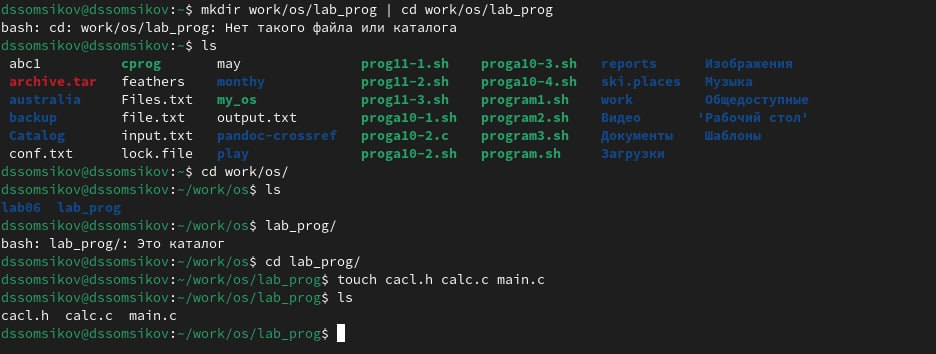{#fig:001 width=100%}

2. Запишем в файлы тексты программ, которые даны в руководстве к лабораторной работе (рис. [-@fig:002]), (рис. [-@fig:003]), (рис. [-@fig:004]).

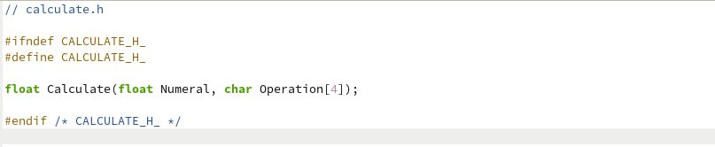{#fig:002 width=100%}
    
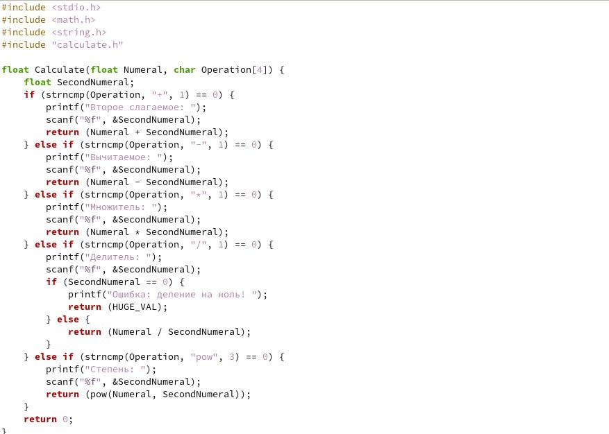{#fig:003 width=100%}

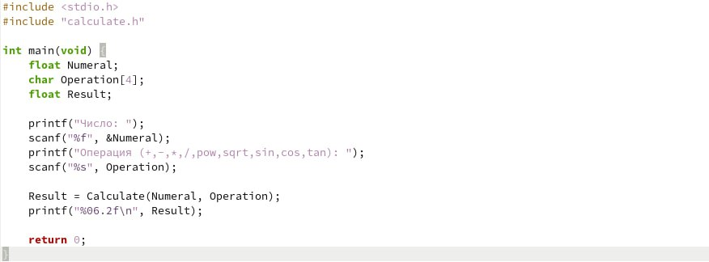{#fig:004 width=100%}

3. Выполним компиляцию программы посредством gcc (рис. [-@fig:005]):

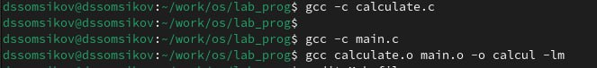{#fig:005 width=100%}

4. Создадим Makefile (рис. [-@fig:006]):
    
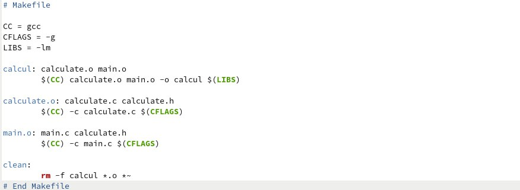{#fig:006 width=100%}

Этот `Makefile` используется для автоматизации процесса компиляции и сборки программы.

Цели и правила в `Makefile`:

- `calcul`: Эта цель отвечает за создание исполняемого файла `calcul`. Она зависит от объектных файлов `calculate.o` и `main.o`. Команда `$(CC) calculate.o main.o -o calcul $(LIBS)` компилирует эти объектные файлы вместе с библиотеками, указанными в переменной `LIBS`, для создания исполняемого файла.

- `calculate.o`: Это правило указывает `make`, как создать объектный файл `calculate.o` из исходного файла `calculate.c` и заголовочного файла `calculate.h`. Команда `$(CC) -c calculate.c $(CFLAGS)` компилирует исходный файл `calculate.c` в объектный файл, используя флаги компиляции, заданные в переменной `CFLAGS`.

- `main.o`: Это правило аналогично предыдущему, но предназначено для создания объектного файла `main.o` из исходного файла `main.c` и заголовочного файла `calculate.h`.

- `clean`: Эта специальная цель предназначена для очистки каталога от файлов, созданных в процессе сборки. Команда `-rm calcul *.o *~` удаляет исполняемый файл `calcul`, все объектные файлы (`*.o`) и временные файлы, созданные редакторами (файлы, оканчивающиеся на `~`).

Знак минуса (`-`) перед командой `rm` указывает `make` игнорировать ошибки при удалении файлов (например, если файл уже был удалён).

5. С помощью gdb выполним отладку программы calcul (я привела код уже исправленного Makefile: ошибка заключалась в отсутствии опции -g у CFLAG):

- Запустим отладчик GDB, загрузив в него программу для отладки, использовав `gdb ./calcul`. Для запуска программы внутри отладчика введем команду `run` и посчитаем некое выражение (рис. [-@fig:007])

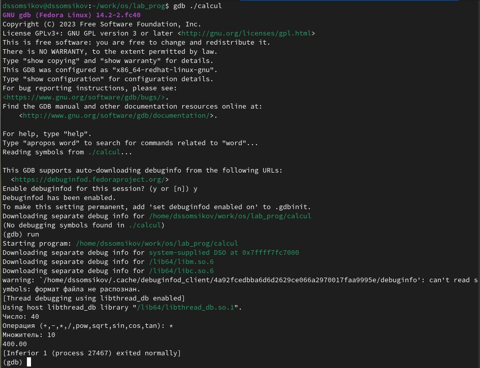{#fig:007 width=100%}

- Для постраничного (по 9 строк) просмотра исходного код используем команду `list`, затем для просмотра строк с 12 по 15 основного файла используем `list 12,15`, просмотрим определённых строк не основного файла, используя `list calculate.c:20,29`, а также установим точку останова в файле calculate.c на строке номер 21, использовав `list calculate.c:20,27` и `break 21` (рис. [-@fig:008]):
    
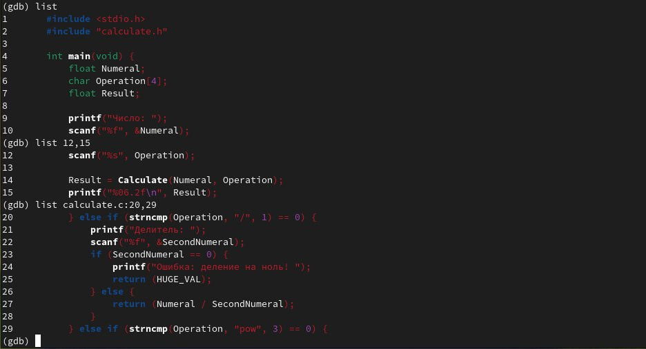{#fig:008 width=100%}

Запустим программу внутри отладчика с помощью `run` и убедимся, что программа остановится в момент прохождения точки останова. С помощью команды `backtrace` покажим весь стек вызываемых функций от начала программы до текущего места. Посмотрим, чему равно на этом этапе значение переменной Numeral, введя `print Numeral` и сравним с результатом вывода на экран после использования команды, использовав `display Numeral`. Посмотрим, информацию про точку останова с помощью `info breakpoints` и удалим эту точку командой `delete 1` (рис. [-@fig:009]):

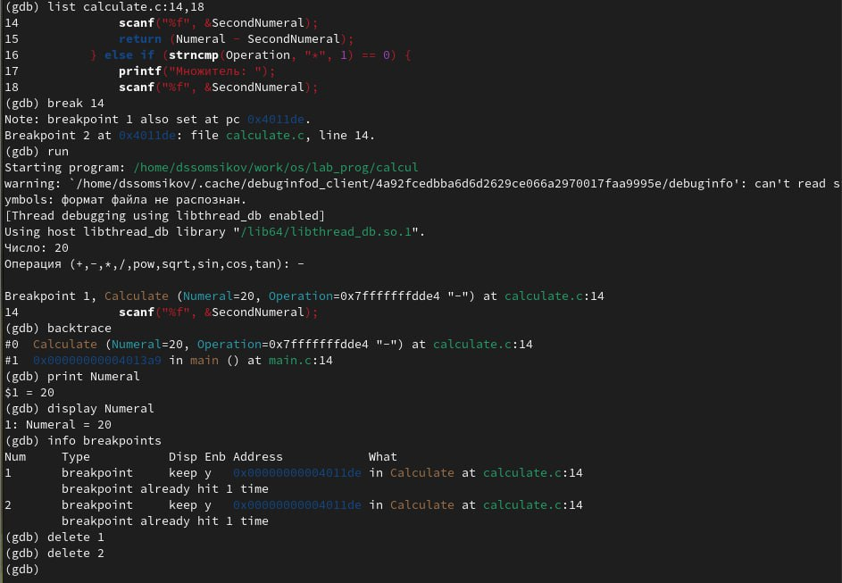{#fig:009 width=100%}

6. С помощью утилиты splint попробуйте проанализировать коды файлов main.c и calculate.c.

Разберем сначала файл main.c. Сначала выводится информация о том, что длина массива, указанная в сигнатуре функции calculate, не имеет никакого смысла и игнорируется. Далее несколько раз выводится информация о том что мы игнорируем возвращаемое значение функции scanf. Всего 3 предупреждения (рис. [-@fig:010]).
    
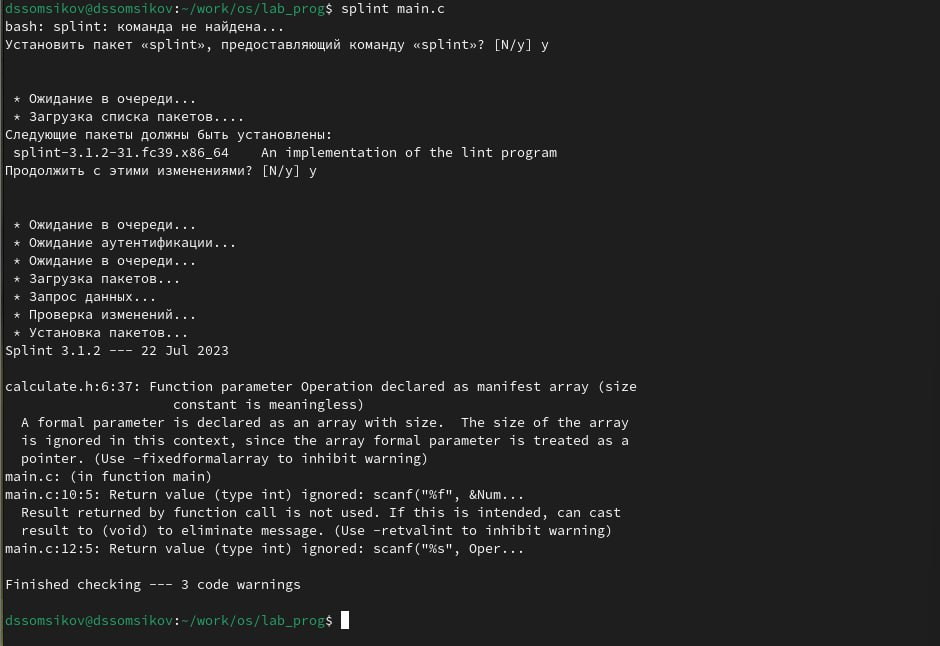{#fig:010 width=100%}

Теперь разберем файл calculate.c. Те же предупреждения о игнорировании длинны массива и возвращаемого значения функции scanf, а также предупреждения о неявном преобразовании типа double в тип float. В сумме 15 предупреждений.

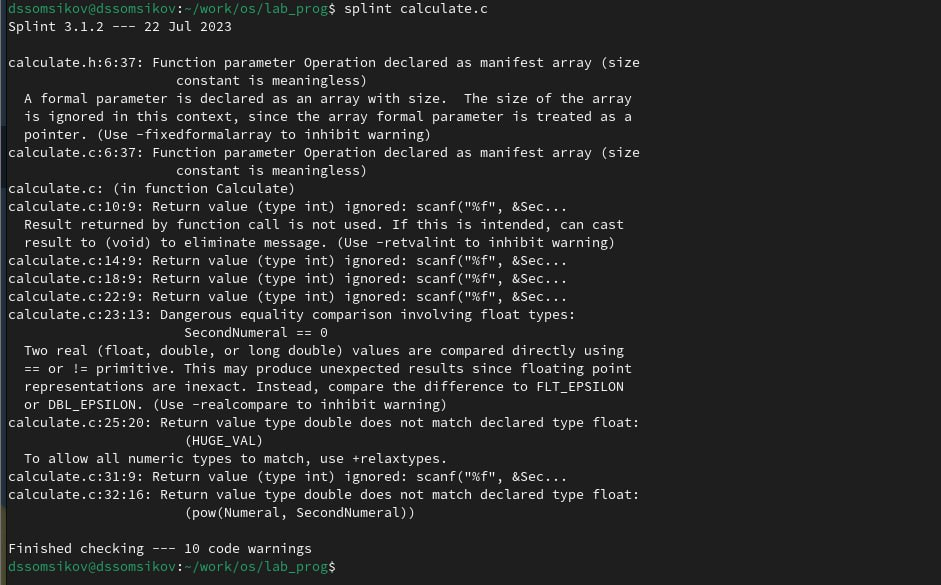{#fig:011 width=100%}

# Контрольные вопросы

1. Как получить информацию о возможностях программ `gcc`{.bash}, `make`{.bash}, `gdb`{.bash} и др.?\
Можно использовать команду `man имя_программы` или посетить сайт проекта _GNU_ [@gnu_docs]. 
2. Назовите и дайте краткую характеристику основным этапам разработки приложений в UNIX.
    - планирование, включающее сбор и анализ требований к функционалу и другим характеристикам разрабатываемого приложения;
    - проектирование, включающее в себя разработку базовых алгоритмов и спецификаций,
    определение языка программирования;
    - непосредственная разработка приложения:
        - кодирование --- по сути создание исходного текста программы (возможно
        в нескольких вариантах);
        - анализ разработанного кода;
        - сборка, компиляция и разработка исполняемого модуля;
        - тестирование и отладка, сохранение произведённых изменений;
    - документирование.
3. Что такое суффикс в контексте языка программирования? Приведите примеры использования.\
В предоставленной теории [@yamad], суффикс эквивалентен расширению файла. Если же мы говорим о языке Си,
в нем суффиксом называется то, что дописывается в конце литерала, например: `3.14f`{.c}. В 
этом примере `f`{.c} суффикс, который говорит о том, что литерал будет иметь тип `float`{.c}.
4. Каково основное назначение компилятора языка С в UNIX?\
Основное назначение компилятора языка Си в UNIX состоит в том, чтобы преобразовывать исходный код, 
написанный на языке программирования Си, в исполняемый файл, который может быть запущен операционной системой UNIX.
5. Для чего предназначена утилита `make`?
Утилита `make` является мощным инструментом автоматизации сборки программного обеспечения, 
который широко используется в UNIX-системах. Ее основное назначение --- управление процессом компиляции и 
сборки программ, обеспечивая эффективное и удобное обновление исполняемых файлов при внесении изменений в исходный код.
6. Приведите пример структуры `Makefile`. Дайте характеристику основным элементам этого файла.\
Пример структуры Makefile и его характеристику можно увидеть на лист. [-@lst:makefile].
7. Назовите основное свойство, присущее всем программам отладки. Что необходимо сделать, чтобы его можно было использовать?\
Основное свойство, присущее всем программам отладки, — это возможность отслеживать выполнение программы, шаг за шагом, и анализировать ее состояние в любой момент времени. Это свойство называется "отладкой" или "debug mode". Отладка позволяет разработчикам выявлять и исправлять ошибки в программе, а также понимать логику ее работы.
Чтобы использовать это свойство, необходимо выполнить следующие шаги:
    1. Включить отладочную информацию при компиляции программы: Это делается с помощью флагов компилятора, 
    например, `-g` в компиляторах _GCC_. Флаг `-g` указывает компилятору включить отладочную информацию в объектные 
    файлы и исполняемый файл. Отладочная информация включает в себя данные о символах (таких как имена переменных 
    и функций), строках кода и расположении переменных в памяти.
    2. Использовать отладчик: Отладчик — это программа, которая позволяет взаимодействовать с выполняющейся 
    целью и контролировать ее выполнение. Примерами отладчиков являются _GDB_ (GNU Debugger) для _C/C++_ программ 
    и pdb для Python-программ. Отладчик позволяет устанавливать точки останова, просматривать значения переменных, 
    выполнять код пошагово и изучать стеки вызовов функций.
    3. Компилировать программу с отключенными оптимизациями: Некоторые оптимизации компилятора могут усложнить процесс отладки.
8. Назовите и дайте основную характеристику основным командам отладчика `gdb`.\
Основные команды отладчика _GDB_ (GNU Debugger) включают в себя следующее:
    - `break`: устанавливает точку останова в указанной строке кода или функции. 
    Когда программа выполняется и достигает точки останова, она приостанавливает свое выполнение, позволяя вам проанализировать ее состояние.
    - `run`: запускает программу под контролем отладчика. Программа выполняется до первой точки останова или до завершения.
    - `continue`: продолжает выполнение программы после остановки в точке останова.
    - `print`: выводит значение выражения или переменной. Это позволяет проверять текущие значения переменных во время выполнения программы.
    - `backtrace`: отображает стек вызовов функций, показывая последовательность функций, 
    которые были вызваны для достижения текущей точки выполнения. Это помогает понять поток управления в программе.
    - `step`: выполняет программу пошагово, переходя к следующей строке кода. Если следующая 
    строка содержит вызов функции, отладчик заходит внутрь этой функции.
    - `next`: выполняет программу пошагово, но в отличие от `step`, он переходит 
    к следующей строке кода, не заходя внутрь вызываемых функций.
    - `finish`: продолжает выполнение программы до выхода из текущей функции.
    - `info breakpoints`: информация о имеющихся точках останова.
9. Опишите по шагам схему отладки программы, которую Вы использовали при выполнении лабораторной работы.
    1. Собрать программу с ключем `-g`
    2. Загрузить программу в отладчик _GDB_.
    3. Расставить точки останова.
    4. Запустить загруженную программу командой `run`.
10. Прокомментируйте реакцию компилятора на синтаксические ошибки в программе при его первом запуске.\
К сожалению, я переписал программу калькулятора без них, так как думал что это опечатки, и у меня не возникло никаких ошибок компиляции.
Просмотрев код программы из [@yamad], я вижу одну грубую ошибку (файл `main.c` строка _16_): `scanf("%s",&Operation);`{.c}, здесь не нужно брать адрес переменной `Operation`, т.к. мы передадим функции `scanf`{.c}
`char**`, а она ожидает `char*`.
11. Назовите основные средства, повышающие понимание исходного кода программы.
    - инструменты статического анализа, линтеры (такие как `splint`{.bash})
    - cовременные IDE предлагают различные функции, облегчающие понимание кода, такие как подсветка синтаксиса и автодополнение
    - отладчики (такие как _GDB_)
12. Каковы основные задачи, решаемые программой `splint`{.bash}?
Программа Splint предназначена для решения следующих основных задач:
    1. Статический анализ кода: Splint выполняет статический анализ кода на языке C, выявляя потенциальные 
    ошибки, проблемы безопасности и нарушения стандартов кодирования. Он проверяет код на соответствие определенным 
    правилам и стандартам, таким как правила из руководства по стилю кодирования MISRA C.
    2. Выявление ошибок времени компиляции: Splint анализирует код на наличие синтаксических и семантических 
    ошибок, которые могут привести к ошибкам во время компиляции. Он проверяет типы переменных, соответствие 
    аргументов функций и соблюдение правил объявления переменных.
    3. Проверка безопасности: Splint специализируется на выявлении потенциальных проблем безопасности в коде, 
    таких как переполнение буфера, использование неинициализированных переменных, ошибки управления памятью и другие 
    распространенные уязвимости. Он помогает разработчикам писать более безопасный и защищенный от атак код.
    4. Подсказки по улучшению кода: Splint предоставляет подсказки и рекомендации по улучшению качества кода. 

```{#lst:makefile .makefile caption="Пример Makefile"}
# Определение переменных
CC = gcc
CFLAGS = -Wall -O2

# Определение цели по умолчанию
all: программа

# Правило для сборки исполняемого файла
программа: программа.o функция.o
    $(CC) $(CFLAGS) -o программа программа.o функция.o

# Правило для компиляции исходного файла в объектный файл
.c.o:
    $(CC) $(CFLAGS) -c $< -o $@

# Правило для удаления объектных файлов и исполняемого файла
clean:
    rm -f программа.o функция.o программа

```

# Выводы

В данной лабораторной работе мы приобрели простейшие навыки разработки, анализа, тестирования и отладки приложений в ОС типа UNIX/Linux на примере создания на языке программирования С калькулятора с простейшими функциями.

# Список литературы{.unnumbered}

1. Руководство к лабораторной работе №12.

::: {#refs}
:::
